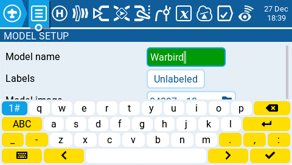
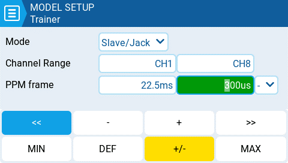

# Virtual Keyboards

To allow for the easy entry of text and numbers, EdgeTX uses virtual text and number keyboards that can be interacted by either the touchscreen or roller. Additionally, there are shortcut keys that are mapped to the hardware buttons as described below:

<figure><figcaption>
Virtual Text Keyboard
</figcaption></figure>

### Shortcuts to the text keyboard using the hardware keys.

#### Radios with a single PGUP/DN keys and the X12S:

* **\[SYS]** = cursor left
* **LONG \[SYS]** = cursor to start
* **\[MDL]** = change keyboard mode (alpha upper, alpha lower, numbers + special, numeric)
* **LONG \[MDL]** = backspace
* **\[PGDN]** = toggle case
* **\[PGUP]** (X12S) = toggle case
* **LONG** PGDN = delete
* **\[TELE]** = cursor right
* **LONG \[TELE]** = cursor to end

#### Radios with separate PGUP and PGDN keys:

* **\[SYS]** = change keyboard mode (alpha upper, alpha lower, numbers + special, numeric)
* **LONG \[MDL]** = backspace
* **\[PGDN]** = cursor right
* **LONG \[PGDN]** = cursor to end
* **\[PGUP]** = cursor left
* **LONG** PGUP = cursor to start
* **\[TELE]** = toggle case
* **LONG \[TELE]** = delete

<figure><figcaption>
Virtual Number Keyboard
</figcaption></figure>

### Shortcuts to the number keyboard using the hardware keys.

#### Radios with a single PGUP/DN keys and the X12S

* **\[SYS]** = '-'
* **LONG \[SYS]** = 'MIN'
* **\[MDL]** = '>>'
* **LONG** **\[MDL]**= '+/-'
* **\[PGDN]** & **\[PGUP]** = '<<'
* **LONG** **\[PGDN]** & **\[PGUP]** = 'DEF'
* **\[TELE]** = '+'
* **LONG \[TELE]** = 'MAX'

#### Radios with separate PGUP and PGDN keys:

* **\[SYS]** = '<<'
* **LONG \[SYS]** = 'MIN'
* **\[MDL]** = '>>'
* **LONG \[MDL]** = 'MAX'
* **\[PGDN]** = '+'
* **\[PGUP]** = '-'
* **\[TELE]**= '+/-'
* **LONG** **\[TELE]** = 'DEF'
