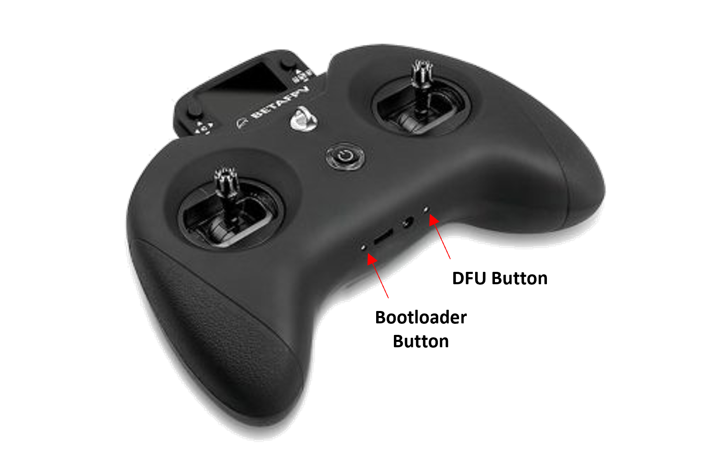
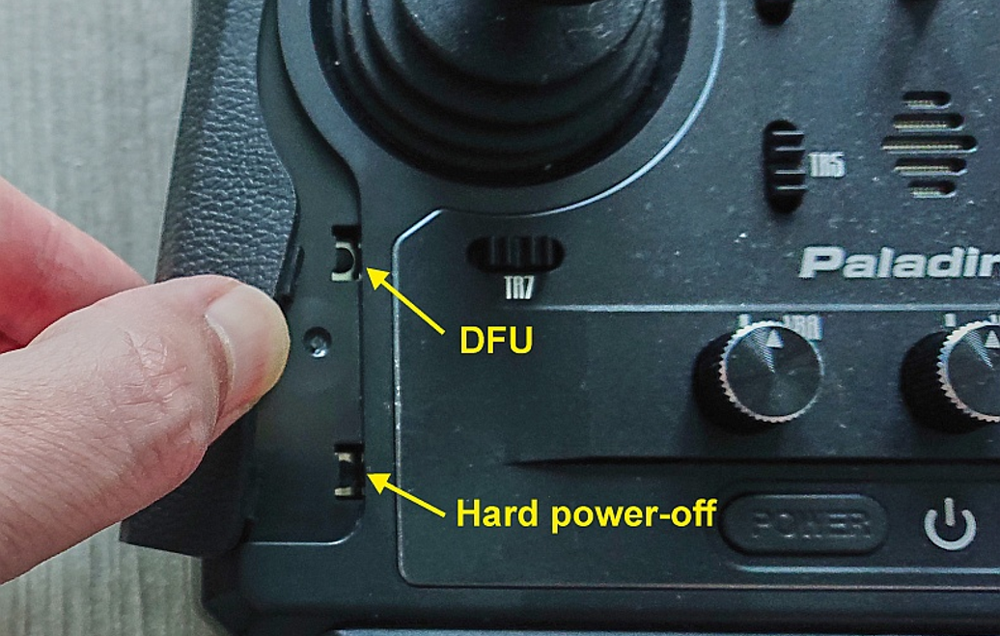
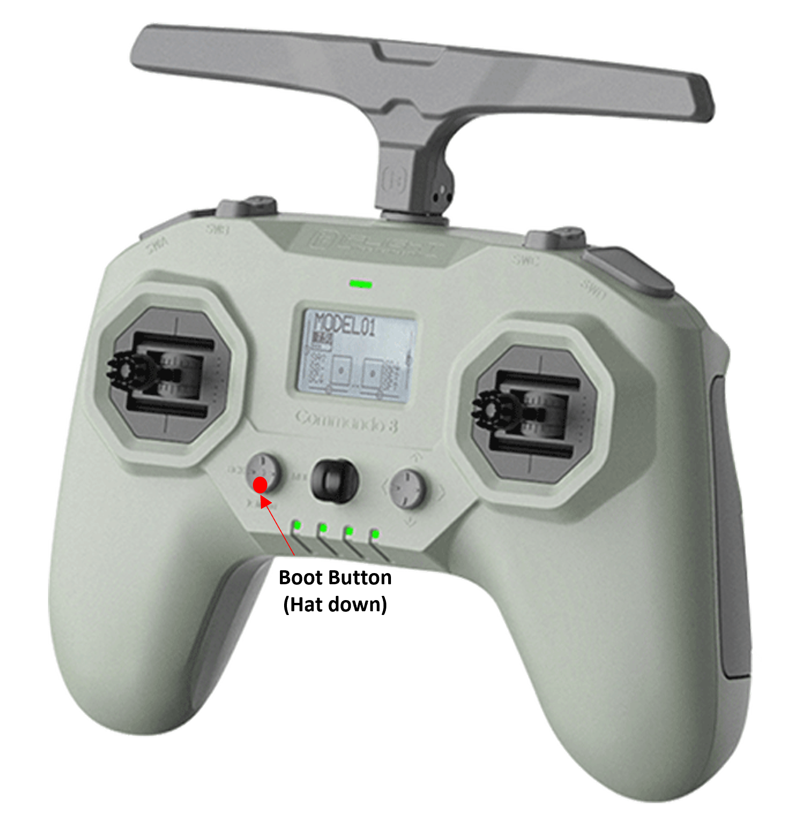
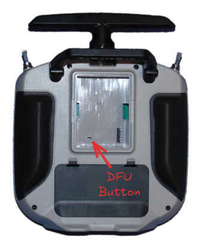
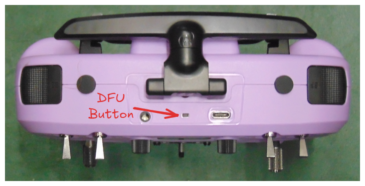
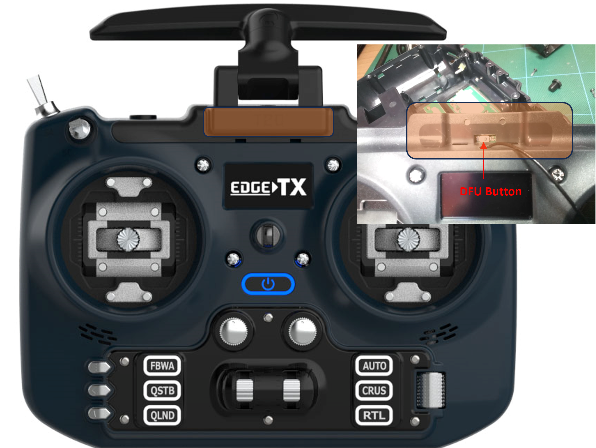
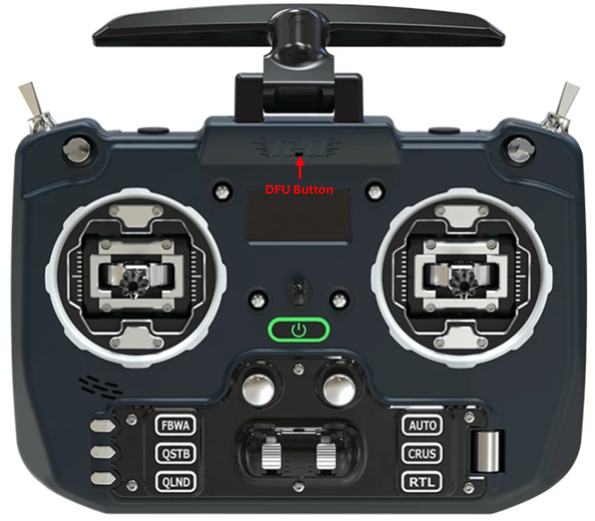
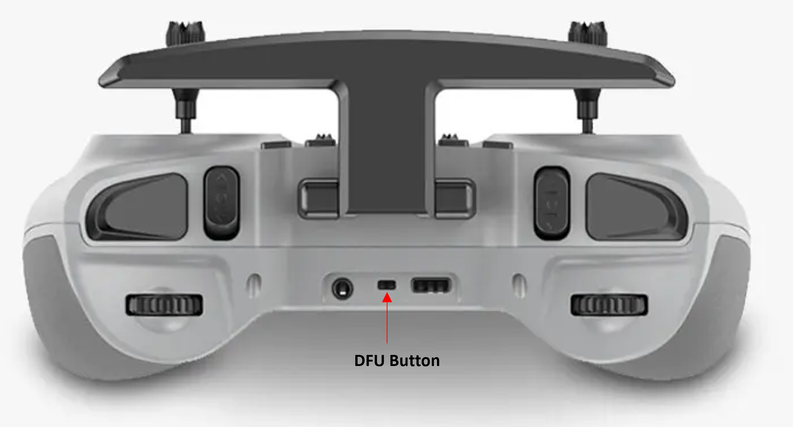

# Access DFU and Bootloader Mode

Not all radios go into Bootloader or DFU mode the same way.  Below you will find descriptions how to get into Bootlader and DFU mode for many EdgeTX radios.

### BETAFPV LiteRadio 3 Pro

<figure><figcaption>
BETAFPV LiteRadio 3 Pro Bootloader and DFU Button
</figcaption></figure>

**Bootloader**: Turn off the radio transmitter. Press the Bootloader button and Power button, release at the same time.

**DFU**: Turn off the radio transmitter. Press and hold the DFU button and plug in the USB cable, release the DFU button.


Note: In early versions of the LiteRadio 3 Pro, the DFU button was non-functional, which prevented DFU mode from being enabled. However, in the current version of the radio, the DFU button has been fixed and is now working correctly.


### FlySky NV14 / EL18

<figure><figcaption>
FlySky NV14/EL18 DFU button
</figcaption></figure>

**Bootloader**: Turn off the radio transmitter. Pull both trims inward and press both power buttons.

**DFU**: Turn off the radio transmitter. Press and hold the DFU button and plug in the USB cable, release the DFU button.

### FlySky PL18 / PL18 EV

<figure><figcaption>
PL18 PL18 EV DFU Button
</figcaption></figure>

**Bootloader**: Turn off the radio transmitter. Pull both horizontal trims (TR7 and TR8) together and press both power buttons.

**DFU**: Turn off the radio transmitter. Press and hold the DFU button and plug in the USB cable, release the DFU button.

### iFlight Commando8

<figure><figcaption>
iFlight Commando8 Boot Button
</figcaption></figure>

**Bootloader**: Turn off the radio transmitter. Press the Boot button and Power button, release at the same time.

**DFU**: Turn off the radio transmitter. Connect the USB cable from your computer to your radio. Hold down the Boot button, then push and hold the Power button. The screen will stay dark, the LEDs will run from left to right. Radio is now in DFU mode.

### Jumper T12/T16/T18

**Bootloader**: Turn off the radio transmitter. Pull both horizontal trim switches together and press the power button.

**DFU**: Turn off the radio transmitter. Plug in the USB cable to the USB port on the top of the radio.

### Jumper T12 MAX

<figure><figcaption>
Jumper T12 MAX DFU Button
</figcaption></figure>

**Bootloader**: Turn off the radio transmitter. Pull both horizontal trim switches together and press the power button.

**DFU**: Turn off the radio transmitter. Press and hold the DFU button and plug in the USB cable, release the DFU button.

### Jumper T14/T15

<figure><figcaption>
Jumper T14/T15 DFU Button
</figcaption></figure>

**Bootloader**: Turn off the radio transmitter. Pull both horizontal trim switches together and press the power button.

**DFU**: Turn off the radio transmitter. Press and hold the DFU button and plug in the USB cable, release the DFU button.

### Jumper T-20/T-20S

<figure><figcaption>
Jumper T-20 v1 DFU Button
</figcaption></figure>


Note: To access the DFU button on v1, remove the antenna. For v2, use a toothpick to gently push the button to avoid damage.


<figure><figcaption>
Jumper T-20 v2 DFU Button
</figcaption></figure>

**Bootloader**: Turn off the radio transmitter. Push both trim hat switches inward together and press the power button.

**DFU**: Turn off the radio transmitter. Press and hold the DFU button and plug in the USB cable, release the DFU button.

### Jumper T-Lite

**Bootloader**: Turn off the radio transmitter. Push both the two inner horizontal trim buttons together and press the power button.

**DFU**: Turn off the radio transmitter. Plug in the USB cable.

### Jumper T-Pro / T-Pro V2

<figure><figcaption>
Jumper T-Pro DFU Button
</figcaption></figure>

**Bootloader**: Turn off the radio transmitter. Push both trim hat switches inward together and press the power button.

**DFU**: Turn off the radio transmitter. Press and hold the DFU button and plug in the USB cable, release the DFU button.

### RadioMaster MT12

**Bootloader**: Turn off the radio transmitter. Pull both trims T1 and T2 together and press the power button.

**DFU**: Turn off the radio transmitter. Plug in the USB cable to the side USB port (under the rubber cover).

### RadioMaster Pocket

**Bootloader**: Turn off the radio transmitter. Push both trim hat switches inward together and press the power button.

**DFU**: Turn off the radio transmitter. Plug in the USB cable to the USB port on the top of the radio.

### RadioMaster (All others - Boxer, T12, Zorro, TX16S)

**Bootloader**: Turn off the radio transmitter. Pull both horizontal trim switches together and press the power button.

**DFU**: Turn off the radio transmitter. Plug in the USB cable to the USB port on the top of the radio.

### Eachine TX16s

**Bootloader**: Turn off the radio transmitter. Pull both horizontal trim switches together and press the power button.

**DFU**: Turn off the radio transmitter. Plug in the USB cable to the USB port on the top of the radio.
