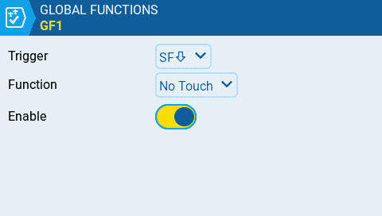
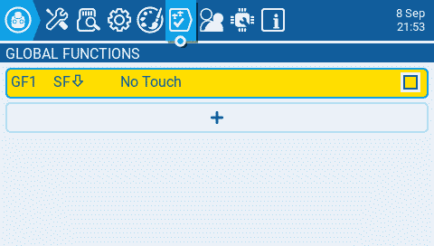
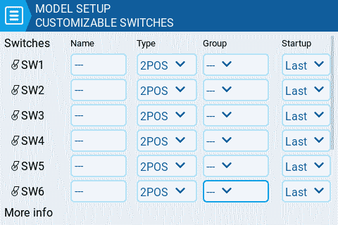
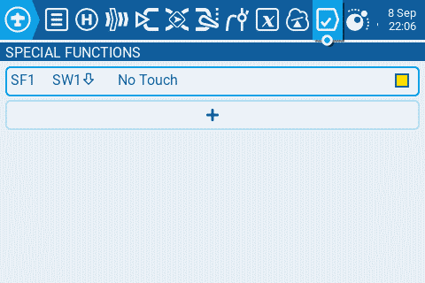

# Disable Touchscreen

There are various reasons on why you may want to disable the touchscreen. Unintentional touches during a flight could change your model configuration which can be a risk.

Therefore we can create a [global function](../color-radios/radio-settings/global-functions.md) or[ special function](../color-radios/model-settings/special-functions.md) using the **No Touch** feature to disable and enable the touch feature. While global functions apply to all models, the special function is defined on individual models.

## Disable touch screen with a global function

In the following example we use switch SF to disable the touch screen with a global function.

<figure><figcaption>
create a global function to disable touch with switch SF
</figcaption></figure>

<figure><figcaption>
show the global function
</figcaption></figure>

## Disable touch screen with a special function

Customizable switches or logical switches cannot be used in global functions. But we can use a special function to enable and disable the touch screen with a customizable switch.

<figure><figcaption>
setup of customizable switches
</figcaption></figure>

<figure><figcaption>
create a special function to disable touch with SW1
</figcaption></figure>

<figure><figcaption>
list of special functions
</figcaption></figure>
