# Set-up wireless trainer with a Multi -protocol module

#### Prerequisites

In order to setup a wireless trainer connection with the Multi-protocolm Module, you will need the following:

* A student radio with a FrSky D16 capable TX module
* An instructor radio with:&#x20;
  * A Multi-protocol module to serve as the RX
  * An additional TX module to use to communicate with the model (protocol does not matter, but must match the protocol use by the RX on the model)

#### Setup

Ensure that the model is bound to the desired TX module and operational on the instructor radio.

On the Instructor radio, configure the **Trainer** section of **Radio Settings**. See [Trainer](../color-radios/radio-settings/trainer.md) section for more information on how to set this page up.

<figure>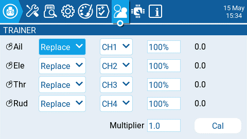<figcaption></figcaption></figure>

 

<figure>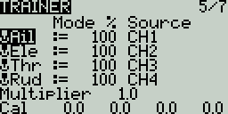<figcaption></figcaption></figure>

On the Instructor radio, configure the **Trainer** section of **Model Settings**. For the **Mode**, select **Master/Multi**

<figure>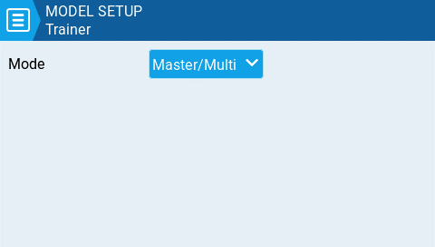<figcaption></figcaption></figure>

 

<figure>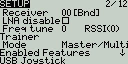<figcaption></figcaption></figure>

On the Instructor radio, configure the special function _**Trainer**_. Designate a switch to activate the mode and make sure the function is enabled.

<figure>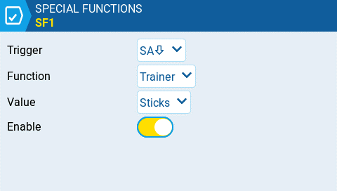<figcaption></figcaption></figure>

 

<figure>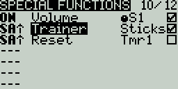<figcaption></figcaption></figure>

On the Instructor radio, configure the **Internal RF** and **External RF** sections in **Model Setup**. The RF Module's mode that will communicate with the Student radio should be set to _**Multi, FRSkyRX**_ and RF Protocol: _**Multi**_. Also, configure a receiver number. Both the Instructor and Student radios need to use this same receiver number. The other RX module should be configured to communicate with the model.

<figure>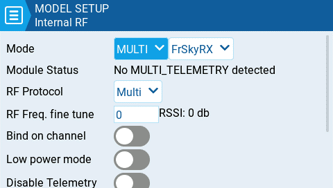<figcaption></figcaption></figure>

 

<figure>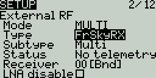<figcaption></figcaption></figure>

One the Student radio, configure either the Internal RF or External RF (which ever module will be used) to communicate to the Instructor radio. If using a multi-protocol module it should be set to _**Multi, FRSkyX**_ and RF Protocol: _**D16**_. Configure the receiver number to the same number configured in the step above.

<figure>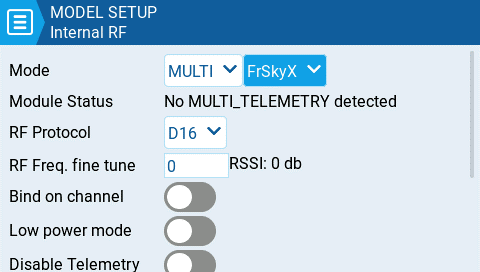<figcaption></figcaption></figure>

 

<figure>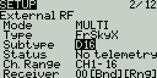<figcaption></figcaption></figure>

On the Student radio, no configuration of the **Trainer** section in the **Model Settings** or **Radio Settings** is necessary, leave the **Mode** option in the **Trainer** section of **Model Settings** configured to **Off**.

<figure><figcaption></figcaption></figure>

 

<figure>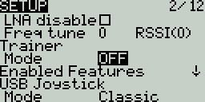<figcaption></figcaption></figure>

**Trainer mode is now configured.**

You can test this by watching the channel monitor on the Instructor radio, activating trainer mode via the configured switch and moving the sticks on the student radio. If configured correctly, you should see the stick movements from the student radio on the channel monitor on the Instructor radio.
