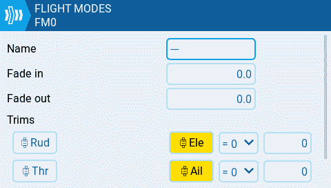
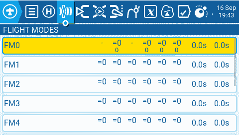
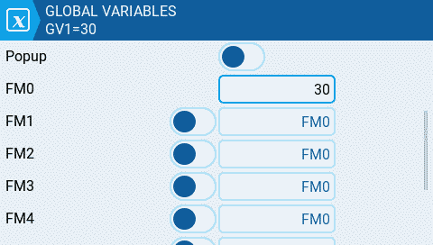
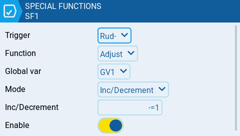
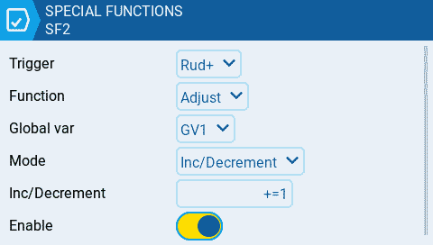
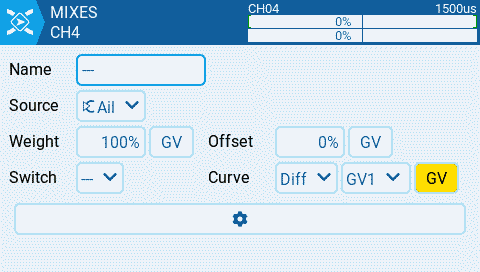

# Use Trims to Adjust Global Variables

There are model types where some or all of the trim switches on your radion are not used. Helicopters or drones with a flight controller usually don't need trims  Also on many fixed wings you may not need all the 4 trims for throttle, rudder, elevator and aileron.

In the following example our model is a glider. Gliders don't need throttle trim. We also don't need the rudder trim, because we can adjust the rudder with the servo sub trim.

Gliders usually use differential on the aileron mixers. The plane rolls perfect when the differential is set to the correct value.

In this sample we will use the rudder trim buttons to adjust the differential of the ailerons. And we will be able to adjust this using the trims in flight.

**Step 1:** Disable the trims for rudder and throttle which are not needed. Then we can reuse them for other functionality. Enter the model menu and navigate to the F[light Modes](../color-radios/model-settings/flight-modes.md) page. Edit **FM0** and disable the Throttle and Rudder trims. The yellow highlight color will be gone when the trims are disabled.

<figure><figcaption>
Disable trims for flight mode
</figcaption></figure>

You can see the disabled trims also on the flight modes page. They now show a dash

<figure><figcaption>
FM0 with disabled trims for throttle and rudder
</figcaption></figure>

**Step 2:** Now we navigate to the [Global Variables](../color-radios/model-settings/global-variables.md) page and set a default value of 30 for **GV1** in **FM0**

<figure><figcaption></figcaption></figure>

**Step 3:** We will now create 2 [Special Functions](../color-radios/model-settings/special-functions.md) to adjust the **GV1** value we created in the previous step. Navigate to the [Special Functions](../color-radios/model-settings/special-functions.md) page and create a new function **SF1** for decreasing **GV1**

<figure><figcaption></figcaption></figure>

* **Trigger** is set to the Rud-  (rudder trim left)
* **Function** is Adjust
* **Global** var is GV1
* **Mode** is Inc/Decrement
* **Inc/Decrement** is set to **-=1**
* **Enable** the special function

We create **SF2** now for increasing the **GV1** value

<figure><figcaption></figcaption></figure>

* **Trigger** is set to Rud+ (rudder trim right)
* **Function** is Adjust
* **Global var** is GV1
* **Mode** is Inc/Decrement
* **Inc/Decrement** is set to +**=1**
* **Enable** the special function

after those 2 special functions are created you can already test the functionality. When you go to Global Variables page you can monitor the GV1 value. The value should change as  you use the trims.

**Step 4:** Now we can adjust our aileron mixer and use the GV1 value for the differential

<figure><figcaption></figcaption></figure>

* **Curve** is set to use Global variables and GV1 is selected

Now you should be able to use the Rudder trim to adjust your aileron differential in flight.
