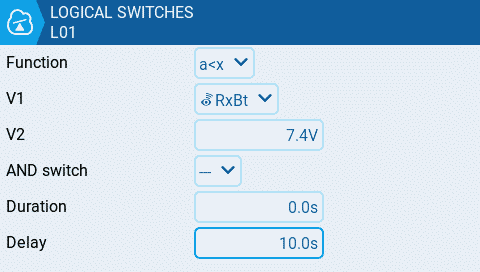
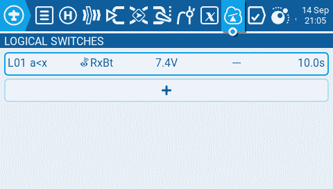
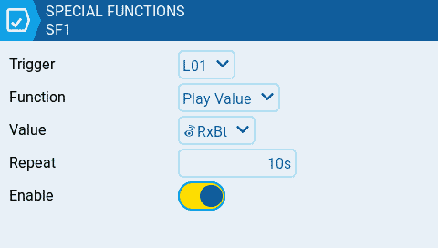

# Configure a low battery alert

This How-To shows the configuration of a low voltage battery alert. Let's assume we have a model that is using a 2S Lipo RX battery. We want to configure an alerts when the battery voltage drops below 7.4V.

Ensure that telemetry data is being received by the radio and the sensors have been discovered within EdgeTX before proceeding.

**Step1:** Create a logical switch that activates when the battery voltage drops below a defined value.

Press the \[MDL] button to open the Model Setup screen and navigate to the [Logical Switches](../color-radios/model-settings/logical-switches.md) tab. Create a new logical switch with the following configuration:

<figure><figcaption>
Create Logical Switch LS1 for a low voltage alert
</figcaption></figure>

* as **Function** use **a\<x**
* **V1** is the telemetry sensor that you want to use for this alert. In this example we are using the RxBt telemetry sensor
* **V2** is the voltage where you want the alarm to trigger
* **Delay** is recommended to configure a delay so that battery sags will not will not cause the alarm to trigger

This logical switch will activate when the TX battery is below 7.4V for the duration of 10 seconds.

<figure><figcaption>
Logical Switch for the low voltage alert
</figcaption></figure>

**Step 2:** Create a [Special Function](../color-radios/model-settings/special-functions.md) that announces the battery value once the logical switch is activated.

Press the \[MDL] button to open the Model Setup screen and navigate to [Special Functions](../color-radios/model-settings/special-functions.md) Tab and create a new Special function with the following configuration.

* **Switch**: This is the logical switch that you configured in the previous step. In this example L01
* **Func**: select the Play Value function from the drop-down so that it will announce the battery voltage when triggered
* **Value**: Select the telemetry sensor that you configured in the previous step. In this example it is RxBt
* **Repeat**: Set the value for how often it should repeat the announcement. In this example it is every 10 seconds
* **Enable**: Enable the Special Function to make it active

<figure><figcaption>
Special Function which plays the low voltage value every 10 seconds
</figcaption></figure>
