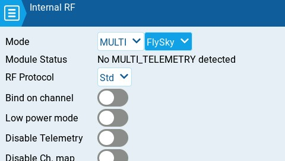

# Internal / External RF

The configuration settings for both the Internal and External RF pages work the same. The only difference is that the **Internal RF** section is for configuring the built-in module and the **External RF** section is for configuring an RF module in the external module bay.

The Internal / External RF modules are "active" for a model when the buttons are yellow and inactive when they are white.

<figure><figcaption>
Internal RF with multi-protocol module selected
</figcaption></figure>

 

<figure><figcaption>
Internal RF with CRSF selected
</figcaption></figure>

The configuration options are: _**off**_ or the _**module name**_ of the installed module as configured in the [_hardware_](../../radio-settings/hardware.md) section of the _**Radio**_** ** settings. Configuration options are unique to each installed module. Please consult the manufacturer's documentation for configuration options.&#x20;


Configuration options for the multi-protocol module are described here:  [https://www.multi-module.org/using-the-module/protocol-options](https://www.multi-module.org/using-the-module/protocol-options)


#### Receiver number

The receiver number is a user-assigned number for a model that is sent to the receiver when bound. Each model must have a unique receiver number. However, models using different protocols may have the same receiver number without issues.  EdgeTX will inform you when a receiver number is unique or if it is already being used with a text above the number field.


If using the radio in gamepad mode, both internal and external RF modules should be turned off. This will result in increased performance when connected to a computer via USB.&#x20;

