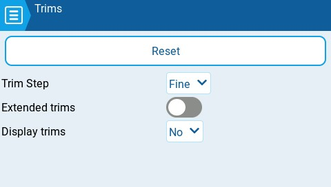

# Trims

<figure><figcaption>
Trims settings page
</figcaption></figure>

Trims are used adjust the center position of a given stick axis. EdgeTX has the following time configuration options:

**Reset** - This resets all trim values to zero.

**Trim Step:** Defines the amount of increase/decrease in trim when the trim switch is pressed.&#x20;

* Course = 1.6%
* Medium = 0.8%
* Fine = 0.4%
* Extra Fine = 0.2%
* Exponential = 0.2% near the center and the step value increases exponentially as the distance from the center increases.

**Extended Trims**: Increases the maximum trim adjustment value from **±**25% to **±**100%.


When switching from extended trims to normal trims, the extended trim value will remain until the trim is adjusted, then it will jump to the max/min normal trim value.


**Display trims:** When set to **ON**, it will display the numerical trim value on the trim bar.  When set to **CHANGE**, it will display the numerical value once the trim is no longer at zero.
