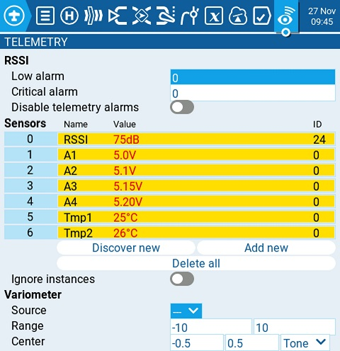

# Telemetry

Telemetry is data received from the model to the radio from various sensors. These sensors may be in included in the radio receiver or flight controller, or may be separate sensors, such as GPS, variometer, or magnetometer. Telemetry data that is received can be displayed by EdgeTX in widgets, configured in alarms or audio call-outs.

<figure><figcaption>
Telemetry screen in Model Settings
</figcaption></figure>

**RSSI**

RSSI stands for the Receiver Signal Strength Indicator and represents the raw strength of the received signal. How the RSSI value is determined is based on the protocol being used, but generally the higher the number the better, with 100 being the maximum value. &#x20;

* **Low alarm** - The threshhold value when the "RF signal low" voice prompt will be played. The recommended value is 45.
* **Critical alarm** - The threshhold value when the "RF signal critical" voice prompt will be played. The recommended value is 42.
* **Disable telemetry alarms** - When enabled, no alarm voice prompts will be played.


RSSI is not a very good indicator of the strength and quality of your RC Link.  Although better than nothing, Link quality (LQI) and RSSI dBm are better metrics to use if your receiver can provide this telemetry data.  &#x20;


**Sensors**

All prevously configured sensors are listed here. Sensors that are highlighted have received data since the model was loaded or the telemetry values were reset. A small circle icon will flash to the left of the sensor value when it has received a data update. Sensor values in black designate the sensors that are receiving regular updates. Sensor values that are red are no longer receiving regular updates. See [Recognized Sensors](../../../../b-and-w-radios/model-select/telemetry/common-telemetry-sensors.md) for a list of commonly used sensors in EdgeTX.

The following options are listed under the sensor list.

* **Discover New:** When selected, it will look for new sensors on the model and automatically configure them.&#x20;
* **Add New:** When selected, it will create a new blank sensor for that must be configured manually.&#x20;
* **Delete All:** This option will delete all prevously configured sensors.
* **Ignore Instances:** This options prevents mutltiple sensors from reporting the same telemetry data.

If you select a specific sensor, you will get the following options:&#x20;

* **Edit**: Allows you to edit the sensor's configuration options.
* **Copy**: Creates a copy of that sensor.
* **Delete**: Deletes that sensor.

See the [Sensor Configuration Options](sensor-configuration-options.md) page for detailed description of all the configuration options for setting-up or editing sensors.

**Variometer**

A variometer detects changes in the model altitude.  EdgeTX can alert the user of these altitude changes by providing a rising/lower pitched tone. Use the **Variometer** menu on the Radio Setup page to set the actual frequency and volume of the tone to be played. The following options exist to configure the variometer alarm.

* **Source** - Specifies the sensor to use as the variometer. It is selected from the telemetry sensors added in **Sensors** section.
* **Range** - Specifies the ascent/descent range that will trigger the change in the Variometer beeping pitch. If climb/descent rate is within the range specified here, beeping pitch will change according to that value. When it goes beyond the range specified here, beeping pitch will stop changing. Units are meters/second or feet/second based on the **Units** setting on the [Radio Setup](../../radio-settings/radio-setup/) page.
* **Center** - Specify the range for ignoring changes in climb/descent rates. When the climb/descent rate is within the range specified here, the beeping pitch will not change.
* **Tone/Silent** - Specifies whether to beep when climb/descent rate is within the range specified by **Center**.

