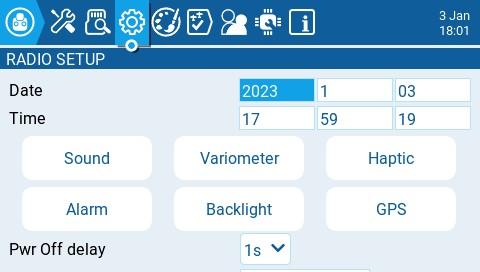

# Radio Setup

<figure><figcaption>
Radio Setup Screen
</figcaption></figure>

The **Radio Setup** screen is where you configure basic settings for your radio. It contains the following options:

**Date** - The current date.  This date is used for the SD card log files.

**Time** - The current time. This time is used for the SD card log files.

**Pwr Off delay** - The delay between when the power button is pushed and when the radio shuts off. The options are: **0s, 1s, 2s, 3s, 4**s. _It is recommended to set at least a 1s delay in order to prevent the radio from being shut off in the case of an accidental button press._

**Owner ID** - Custom registration ID used only for users with ISRM modules.

**Country code** - Used by some RF modules to ensure adherence to local regulatory RF requirements. Options are **America, Japan, Europe.**

**Voice language** - Language for the voice pack. This setting and the voice pack folder on the SD card must match for the sounds to be played.

**Units** - Units of measure. Options are **metric** or **imperial**.

**Play delay** (sw. mid pos) - The minimum time in milliseconds a switch must be in the middle position before a special function will get activated. This is used to prevent the middle position from being activated on a three-position switch when switching from low position to high position.

**USB Mode** - Sets the default action when a USB cable is plugged into the USB data port and the radio is powered on.  Options are: **Ask**, **Joystick**, **Storage**, and **Serial**.

**Rotary Encoder Mode** - Set to **Normal** by default. The **Inverted** option reverses the direction of the roller.

**Default Channel Order** - The default channel order for new models and the trainer screen.  The letters stand for: **A** = Aileron, **E** = Elevator, **T** = Throttle,  **R** = Rudder. Changing this setting does not affect existing models.

**Mode** - The stick mode that will be used for the transmitter. Defined by what actions the left stick takes. The options are:

* 1: Left = yaw+pit (pitch)
* 2: Left = yaw+thr (throttle)
* 3: Left = rol (roll)+pit (pitch)
* 4: Left = rol (roll)+thr (throttle)

**Model quick select** - Affects model selection screen. Both options require you first to mark the desired model using the scroll wheel or short tap.
- When OFF: short/long tap (short/long ENTER) on the marked model will show the menu, where you can "Select model";
- When ON: short tap (short ENTER) on the marked model will select it immediately. To activate the menu, make a long tap or long ENTER.
