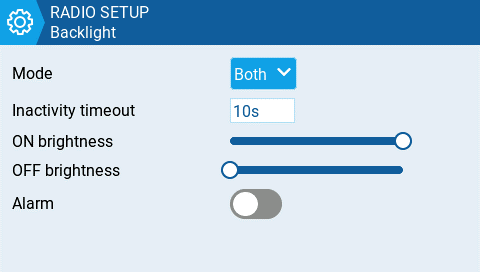
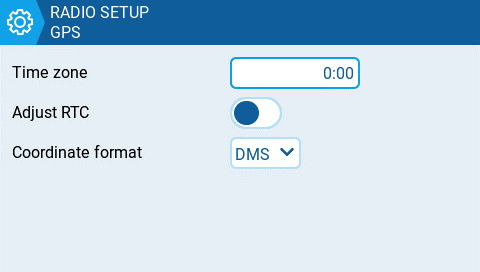

# Additional Radio settings

Selecting one of the 6 buttons on the **Radio Setup** screen will take you to one of the additional setting screens below.

Many of the additional settings here are self-explanatory. Only those settings needing clarification will be mentioned below.

### Sound

<figure><figcaption>
Sound Options
</figcaption></figure>

**Mode** - configures when to play sounds.

* **All -** Beeps when the buttons are pressed and sounds are played when there are alerts or warnings.
* **No Key -** No beeps when buttons are pressed or the scroll wheel is turned but does play sounds when there are alerts or warnings. Also plays sounds triggered by special functions.
* **Alarm -** Only plays alarm or warning sounds. Also plays sounds triggered by special functions.
* **Quiet -** No Beeps or sounds are played.&#x20;

**Volume**

The master volume for the radio.

**Wav volume**

The volume for alerts and warnings and sounds that are played with the **Play track** special function

**Background volume**

The volume for background .wav files (music) that are played with the **BGMusic** special function&#x20;

### Variometer

<figure><figcaption>
Variometer options
</figcaption></figure>

**Repeat Zero**

The time before the tone repeats in milliseconds.

### Haptic

<figure><figcaption>
Haptic (vibration) options
</figcaption></figure>

**Mode** - configures when the radio vibrates.

* **All -** Vibrates when the buttons are pressed and when there are alerts or warnings.
* **No Key -** No vibrations when buttons are the pressed or scroll wheel is turned but does vibrate when there are alerts or warnings.&#x20;
* **Alarm -** Only vibrates for alarms or warning sounds.
* **Quiet -** No vibrations are made.

### Alarms

<figure><figcaption>
Alarm options
</figcaption></figure>

#### Sound Off

An "alarms disabled" visual warning is displayed when the transmitter is turned on if the sound mode is set to quiet.

#### Check RSSI on Shutdown

Checks if a receiver is still connected to the radio on attempted shutdown. Makes a audio and visual alert if one is detected.&#x20;

### Backlight

<figure><figcaption>
Backlight options
</figcaption></figure>

**Mode**

* **Off** – Always off.
* **Keys** – Turns on when buttons are pressed.
* **Ctrl** – Turns on when sticks, switches, and knobs are used.
* **Both** – Turns on when buttons, sticks, switches, and knobs are used.
* **ON** – Always on.

#### Time&#x20;

The length in seconds that the backlight is on. The minimum value is 5 seconds. The maximum value is 600 seconds.

#### Alarm

The backlight turns on when there are alarms or warnings.

### GPS

<figure><figcaption>
GPS options
</figcaption></figure>


The GPS configuration settings are only for when a GPS has been installed on the radio, not the model's GPS.


#### Coordinate Format

The GPS coordinate format that will be displayed.

#### Adjust RTC

Adjust the transmitter's real-time clock to match the time determined by the GPS.

### Enabled Features

<figure><figcaption></figcaption></figure>

The **Enabled Features** section of Radio Setup allows you to configure the _**Global**_ _**settings**_ for which tabs are visible in the Radio Setup and Model Settings area of EdgeTX.&#x20;


_**Note:**_ Turning off a tab only hides the tab and does not change the items already configured in that tab. For example, if you configure a special function and then turn off the special functions tab, the special function will still work as configured.

