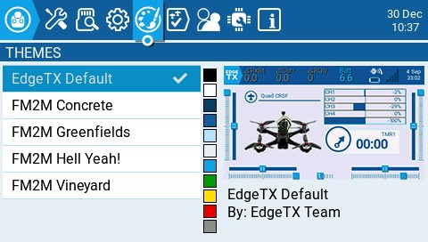
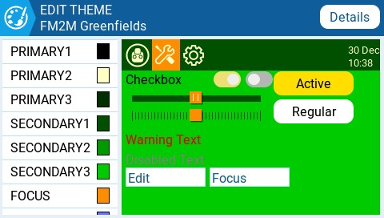
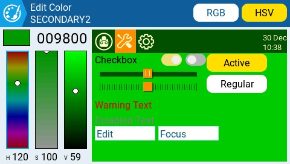

# Themes

<figure><figcaption>
Themes Screen
</figcaption></figure>

The **Theme** screen allows you to apply different colored themes to your radio. By default, the EdgeTX SD card comes with the themes shown above. Long pressing on a selected theme will give you the following options:

* **Set Active** - Sets the selected theme as the active theme.
* **Edit** - Opens the theme editor to edit the selected theme.
* **Duplicate** - Makes a copy of the selected theme.
* **Delete** - Deletes the selected theme.


You can find more user-created themes and additional theme creation resources here: [https://github.com/EdgeTX/themes](https://github.com/EdgeTX/themes)


<figure><figcaption>
Edit Theme Screen
</figcaption></figure>

 

<figure><figcaption>
Edit Color screen
</figcaption></figure>

To edit a theme in the **Theme Editor**, select the color variable from the list on the left side of the screen. Once you do, the **Edit Color** screen will be shown.&#x20;

Select the color using either the color scales on the left side of the screen. You can choose between the RGB and HSV color scales with the buttons at the upper right side of the screen.&#x20;

Once you have your desired color, press the theme logo in the upper left corner to go back to the **Edit Theme** screen to select another color variable to edit. Once you are finished, press the theme logo to exit the Theme Editor and save your changes.
