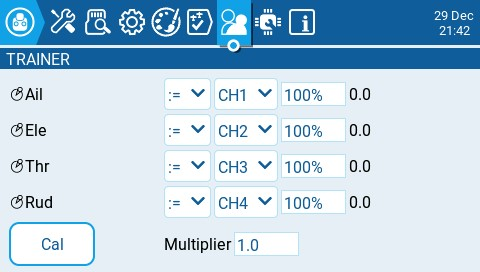

# Trainer

The **Trainer** screen in Radio Settings is used to configure how the instructor’s radio transmitter will handle the signals from the student's radio transmitter. It contains the below configuration options.&#x20;

<figure><figcaption>
Trainer screen in Radio Settings
</figcaption></figure>

For each of the four main control inputs (Ail, Ele, Thr, Rud) the following options can me configured (for each row, from left to right).

* **Mode -** How the instructor’s radio will handles the signals from the student's radio&#x20;
  * **OFF** - Stick values from the instructor’s radio will be used - no input from the Student's radio.
  * **+=** Adds the stick values from both the instructor’s radio and student’s radio.
  * **:=** Replaces the instructor’s stick values with the student’s radio. (Default)
* **Source channel** - The channel from the student’s radio that is mapped the control input.
* **Weight** - Percentage value of the Students stick travel to use. Use negative values to change stick direction.
* **Cal (calibrate)**- Sets the centre value of the student’s transmitter.
* **Multiplier** - This value changes the weight for all the sticks together.&#x20;


The trim from the instructor’s transmitter is usually used. Set the trims on the student’s transmitter to their centres.



The instructor’s transmitter is the one that gets bound to the model receiver.

