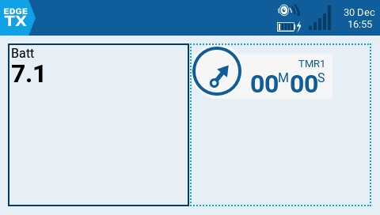
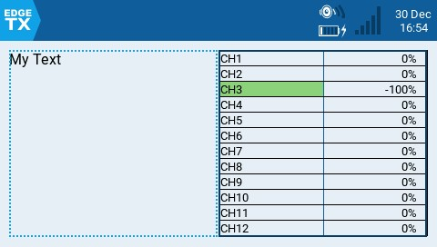
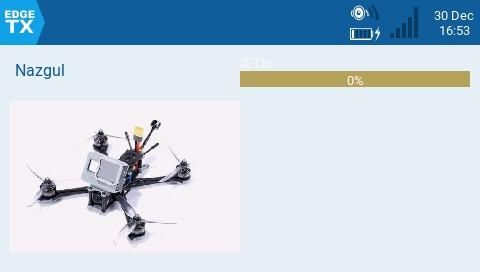
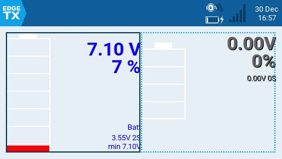
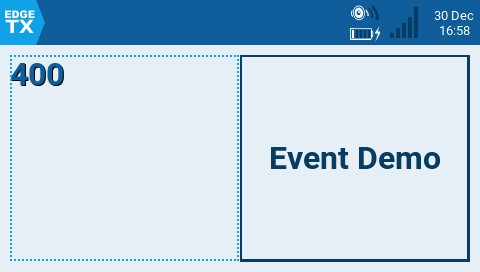
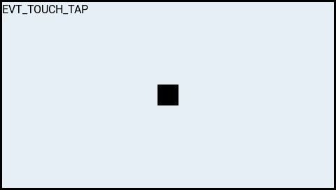
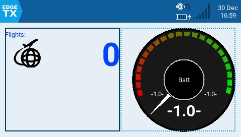
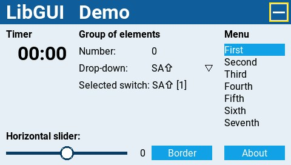
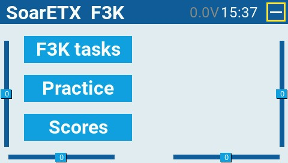
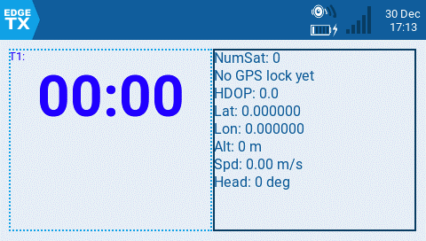

# Widgets


After a widget has been setup, long pressing on the widget will give you the two menu options: **Full screen** and **Widget** settings. For some widgets, full-screen mode will offer additional functionality. To exit out of full-screen mode, long-press the RTN / Back button.


Below are descriptions and configuration options for widgets included with EdgeTX.

<figure><figcaption>
Value and Timer widgets
</figcaption></figure>

**Value** - displays a numeric value of the defined source as text. The configurable options are:

* **Source** - source for the text to be displayed
* **Color** - Opens the color picker to choose the color for the text. User can choose between RGB and HSV color model to choose the color.
* **Shadow** - When enabled, adds a shadow to the text.

**Timer** - Displays the selected timer. No configurable options other than timer selection.

<figure><figcaption>
Text and Outputs widgets
</figcaption></figure>

**Text** - Displays a user-customizable text field. The configurable options are:

* **Text** - Text to display
* **Color** - Opens the color picker to choose the color for the text.&#x20;
* **Size** - Size for the text. Options are STD (Default), BOLD, XXS, XS, L, XL, XXL
* **Shadow** - When enabled, adds a shadow to the text.

**Outputs** - Shows the channel output values in a bar graph. The number of channels that are displayed is dependent on the size of the widget. The configurable options are:

* **First channel** - selects the first channel to display in the widget.
* **Fill background** - Adds a solid background color to the widget when enabled
* **BG Color** - Opens the color picker to choose the color for the background.
* **Text Color** - Opens the color picker to choose the color for the text.
* **Color** -  Opens the color picker to choose the color for the output bars.

<figure><figcaption>
Model info and Gauge widgets
</figcaption></figure>

**Model info** - Displays the selected model name and picture (if configured in model settings). The configurable options are:

* **Color** - Opens the color picker to choose the color for the name text.
* **Size** - Size for the name text. Options are STD (Default), BOLD, XXS, XS, L, XL, XXL
* **Fill background?** - Adds a solid background color to the widget when enabled
* **BG Color** - Opens the color picker to choose the color for the background.
* **Use Theme Color** - When enabled, overrides the text color with the text color of the configured theme.

**Gauge** - Shows a bar graph for the source value. The configurable options are:

* **Source** - Source for the gauge.
* **Min** - Minimum value for the gauge. This value will be 0%&#x20;
* **Max** - Maximum value for the gauge. This value will be 100%&#x20;
* **Color** - Opens the color picker to choose the color for the gauge text and bar.

<figure><figcaption>
BattAnalog and BattCheck widgets
</figcaption></figure>

**BattAnalog** - Displays a graphical representation of the charge level of a Lipo/Li-ion. It will automatically detect the cell count of the battery. It works with telemetry where only the total battery voltage is received. The configurable options are:

* **Sensor** - Sensor for the battery voltage to use.
* **Color** - Opens the color picker to choose the color for the text.
* **Show\_Total\_Voltage** - Shows total battery voltage (instead of calculated cell voltage) when enabled.
* **Lithium\_Ion** - Adjusts the minumum battery voltage used in calculating the remaining battery percentage from 3.0 to 2.8 when enabled.

**BattCheck** - Displays a graphical representation of the charge level of a Lipo/Li-ion. It works with telemetry where individual cell voltage is received, such as FLVSS liPo Voltage Sensor. The configurable options are:

* **Sensor** - Sensor for the battery voltage to use.
* **Color** - Opens the color picker to choose the color for the text.
* **Shadow** - When enabled, adds a shadow to the text.
* **LowestCell** - When enabled, shows only the voltage of the lowest cell (vs. showing all cell voltages).
* **Lithium\_Ion** - Adjusts the minimum battery voltage used in calculating the remaining battery percentage from 3.0 to 2.8 when enabled.

<figure><figcaption>
Counter and Event Demo widgets
</figcaption></figure>

 

<figure><figcaption>
Event Demo widget full screen
</figcaption></figure>

**Counter** - It incrementally counts. The configurable options are:

* **Color** - Opens the color picker to choose the color for the text.
* **Shadow** - When enabled, adds a shadow to the text.

**Event Demo** - Demonstrates handling of key and touch events in full screen mode. For demo purposed only. The configurable options are:

* **Size** - Changes the size of the box in full screen mode.

<figure><figcaption>
Flights and Guage Rotary widgets
</figcaption></figure>

**Flights** - Counts your number of flights. The configurable options are:

* **switch** - Designated Arm/Safe switch.
* **motor\_channel** - Channel for the motor.
* **min\_flight\_duration** - Minimum flight duration for the flight to be counted.
* **text\_color** - Opens the color picker to choose the color for the text.
* **debug** - When enabled, shows status information on the widget.

_**Additional notes regarding this widget:**_

The flight is considered successful if after 30sec the engine is above 25%, telemetry is active (to indicated that the model connected), and safe switch ON. The flight is considered ended after 8 seconds of battery disconnection (detected by no telemetry) -- warning: do NOT use this widget if model is using GV9!!!

The widget assumes the following: the model has a motor, the motor is activated on channel 3 (can be configured in settings), there is telemetry with one of the above \[RSSI|RxBt|A1|A2|1RSS|2RSS|RQly], there is a safe switch (arm switch), and global variable GV9 is free (i.e. not used).

**Gauge Rotary -** a configurable analog style gauge with a needle. Also shows the minimum and maximum values that were read by the gauge with green and red needles. The configurable options are:

* **Source** - Source for the gauge.
* **Min** - The minimum (lowest) gauge value.
* **Max** - The maximum (highest) gauge value.
* **HighasGreen** - **Enable** for a sensor where high values are good. **Disable** for sensor where low values are good.
* **Precision** - The precision of the number value to display in decimals.&#x20;

<figure><figcaption>
Ghost widget in RF and Video Mode
</figcaption></figure>

 

<figure><figcaption>
LibGUI widget full screen
</figcaption></figure>

**Ghost**- The Ghost widget will display RF receiver or video transmitter telemetry data based on the mode that is configured.&#x20;

In normal mode, the widget provides RF Mode (RFMD), Frame Rate (FRATE), Link Quality (RQLY), and Transmit Power (TPWR)&#x20;

In video mode, the widget provides Video Band (VBAN), Video Frequency (VFRQ), Video channel (VCHAN), and Video Power (VPWR)

**LibGUI Demo -** This widget is a demo for the LibGUI library. This library is not normally run by itself. Instead, it provides interactive functions to other Lua scripts that use it. The widget must be run in full-screen mode to demo the library's functionality.

<figure><figcaption>
SoarETX F3K widget
</figcaption></figure>

**SOARETX** - The EdgeTX version of the SoarOTX tool.  It is a package of sailplane models for EdgeTX transmitters. It provides Lua scripts for timing and scorekeeping, graphing of log data (e.g. altitude graphs), and model configuration.

For more information about the configuration and use of this widget please see  [https://github.com/jfrickmann/SoarOTX/wiki/SoarETX-for-color-radios](https://github.com/jfrickmann/SoarOTX/wiki/SoarETX-for-color-radios).

A demo of this tool can be seen here: [https://www.youtube.com/watch?v=5NSvxUNKM\_c](https://www.youtube.com/watch?v=5NSvxUNKM\_c)

<figure><figcaption>
Timer2 and TxGPStest widgets
</figcaption></figure>

**Timer2** - Displays the selected timer with the timer text scaled based on the select widget size and has the following configuration options:

* **TextColor** - Opens the color picker to choose the color for the text.
* **Timer** - Timer to display.
* **use\_days** - Shows days when the time value is over 24 hours when enabled.

**TxGPStest** - Displays GPS Information in text format. There are no configurable options.

