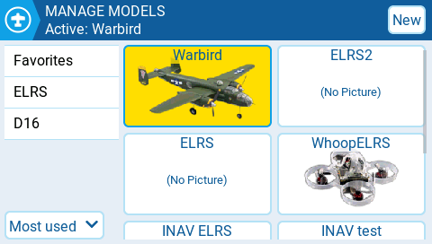
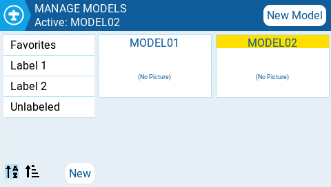
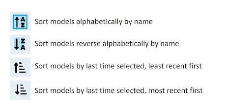

# Manage Models

The Manage Models screen allows you to create new models, select which model is active, create and apply model labels, and create model templates.

<figure><figcaption>
Manage Models screen
</figcaption></figure>

### Selecting & managing existing models&#x20;

The active model's name will be highlighted (yellow in this case) and displayed on the screen's top bar. Double-tapping an active model will give you the following options:

* **Duplicate model** - This option creates an exact duplicate of the model with the same name. Changes to the model name or other settings need to be made in the [Model Settings ](model-settings/)tab.
* **Label Model** - When this option is selected, all configured labels will be displayed and can be selected for this model. More Information about [Model Labels](select-model.md#model-labels) is below.&#x20;
* **Save as template** - this option saves a copy of the model as a model template.


Changes to models saved as templates do not update the templates themselves.


Double-tapping on a non-active model (unhighlighted) will give you the following options:

* **Select model** - this option selects this model as the active model.
* **Duplicate model** - same as described above.
* **Delete model** - this option moves the model to the deleted folder on the SD Card. _Only models that are not active can be deleted._
* **Label model** - same as described above.
* **Save as template** - same as described above.

### Creating a new model

To create a new model, select the **New Model** button in the upper right corner. You will then be presented with the following options:&#x20;

<figure><figcaption>
New model options
</figcaption></figure>

* **Blank Model** - This will create a blank model with only the default options configured.
* **PERSONAL** - This option will allow you to select one of your saved model templates and then create a copy of it as a new model.
* **SoarETX** - This will display pre-configured model templates for radio-controlled model sailplanes.
* **WIZARD** - This will launch the new model wizard and create the model as configured in the wizard.

### Model Labels

Model labels allow you to give each model one or more labels. You are then able to filter the models displayed in the **Model Select** screen based on the labels that you select. This allows people with many configured models to find them easier.  By default, the **Favorites** and **Unlabeled** labels are created automatically. All models are considered **unlabeled** until a label is applied to them.

<figure><figcaption>
Model label filters and sorting
</figcaption></figure>

### Filtering models using labels

To filter the visible models based on their labels, select the filter or filters from the left column. It will automatically filter out the models that do not have those model labels.

### Assigning labels to models

To assign a label to a model, double-tap on the model or press **\[Enter]** when the model is selected and then select **Label Models**. Once selected, all configured labels will be displayed and one or more labels can be selected for this model. Labels applied to the model will be designated with a _**check**_ icon.

### Creating new model labels

To create a new model label, select the **New** button on the bottom left of the screen. The **Enter Label** pop-up will appear and you can enter the desired label name. Select **Save** to save the new label.

### Editing model labels

Long press \[Enter] or long tap on desired label and you be shown a menu with the following options:

* Rename Label - change the label's name
* Delete Label - Deletes the label from the label list and from all models that have it assigned.&#x20;
* Move Up - positions the label higher on the list&#x20;
* Move Down - - positions the label lower on the list

### Sorting Models

The icons below the label list are for sorting the filtered models. Models can be sorted either alphabetically or by the last time they were selected as described in the image below.

<figure><figcaption>
Sorting icon definitions
</figcaption></figure>

