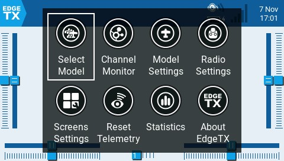

# User Interface

The user interface of EdgeTX can be navigated by physical buttons, the touch interface, or a combination of both.

<figure><figcaption>
Common buttons for navigation
</figcaption></figure>

### **Buttons:**

* **\[SYS]** - System Button\
  ****- Short press **\[SYS]** button to go to the [Radio Settings](radio-settings/) page.
* **\[MDL]** - Model **** Button\
  ****- Short press **\[MDL]** button to go to the [Model Settings](model-settings/) page\
  \- Long press **\[MDL]** button to go to the Model Browser page
* **\[RTN] -** Return / Back \
  \- Short press **\[RTN]** button to return to the previous page, previous menu or cancel action
* **\[PAGE>] / \[PAGE<]** - Page next & page previous\
  ****- Used to navigate between different screens, tabs, or options settings, depending on the screen.
* **\[TELE] -** Telemetry \
  \- Press the **\[TELE]** button to go to the [Screen Settings](screen-settings/) page
* **\[Roller]** or **\[Dial]** - Next & previous value\
  The roller is used to navigate through menu options. &#x20;
* **\[Enter]** - Accept \
  \- Used to select option, function or accept value\
  \- Push **\[Roller]** or **\[Dial]** button to select or enter.

### **Touch Interface**:

Certain radios are equipped with a touch screen.  On these radios, you can interface with the menu options either with touch or physical buttons.&#x20;


It is possible to disable the touch interface by configuring a special function. See  [special-functions.md](model-settings/special-functions.md "mention") for more information.


Touch the EdgeTX icon in the upper left corner of the screen to open the main navigation menu. Touch the desired menu option to select it.

<figure><figcaption>
Main navigation menu
</figcaption></figure>


For models that have **Display Checklist** enabled in the [Preflight Checks](model-settings/model-setup/preflight-checks.md) screen and a valid model checklist file in the **Models** folder you will see a **Model Notes** icon instead of the **Channel Monitor** icon.


Pressing the roller from the main screen will also open the main navigation menu. You can then scroll using the roller to the desired menu option and select it by pressing the roller.
