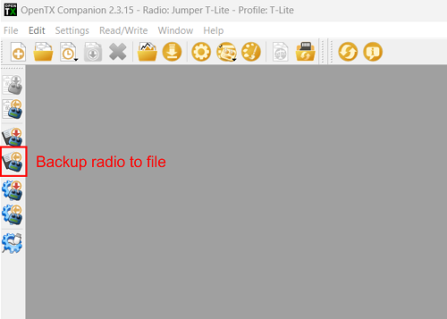
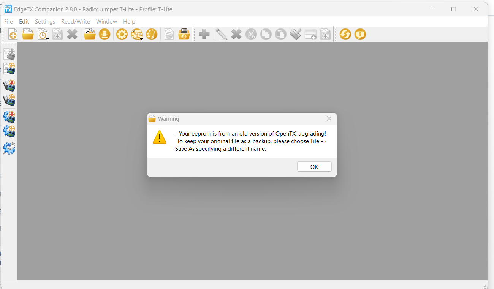

# Migrate from OpenTX to EdgeTX using the Bootloader

In order to update from OpenTX to EdgeTX you will need to have both OpenTX & EdgeTX Companion installed on your computer.  You can download OpenTX Companion from: [https://downloads.open-tx.org/2.3/release/companion/](https://downloads.open-tx.org/2.3/release/companion/). You can download EdgeTX Companion from: [https://github.com/EdgeTX/edgetx/releases](https://github.com/EdgeTX/edgetx/releases) (File name: edgetx-cpn-\[operation system]-\[version].zip)

### Backing up your Models

Turn on your radio, navigate to **Radio Settings**, **Hardware** and scroll down to the bottom of the screen and select **EEPROM backup**. If you do not have this option, then your radio does not store your data in EEPROM and this step can be skipped. 

<figure><figcaption></figcaption></figure>

With your radio powered on, plug your radio into your computer via USB. When prompted by your radio for the USB mode, select **USB Storage**.&#x20;

With your computer, copy the entire contents of your SD card to a safe place on your Computer. If you ever decide to go back to OpenTX you can use these files again. If you backed up your EEPROM in the step above, check the EEPROM folder to make sure that there is a recent backup file in there.

Start OpenTX Companion.&#x20;

Select the **Backup radio to file** icon from the left side of the screen as shown below. Select a saving location (desktop is fine) and give it a descriptive name.

<figure><figcaption></figcaption></figure>

After the file has been saved, close OpenTX Companion. Unplug the radio from the computer and power it off.

### SD Card Preparation

Download and extract the EdgeTX SD card content for your radio type to your computer. The SD card contents can be found here: [https://github.com/EdgeTX/edgetx-sdcard/releases](https://github.com/EdgeTX/edgetx-sdcard/releases)

The list below shows which .zip file to use for different radio types:

* c480x272zip (480x272 Horizontal Color Screen) - TX16s, T16, Horus x10s,Horus x12s, most color screen radios...
* c480x320 (480x320 Horizontal Color Screen)
* c320x480zip (320x480 Verticle Color Screen)- FlySky Nirvana NV14, EL18
* bw128x64.zip (128x64 BW Screens) -All monochrome screen radios _except_ X9D series.
* bw212x64zip (212x64 BW Screens) - X9D, X9D Plus, X9D Plus 2019

Delete everything from your SD card and copy the contents of the unzipped folder to your blank SD card. (If you did a format, ensure it is set to fat32)

Copy over any custom sounds, model images, widgets or Lua scripts to their respective folders.

Download the desired sound pack (if you didn’t transfer your existing sounds) ([https://github.com/EdgeTX/edgetx-sdcard-sounds/releases](https://github.com/EdgeTX/edgetx-sdcard-sounds/releases)), unzip and copy to the "Sounds" folder on your SD card.

### Flashing the EdgeTX Bootloader and Firmware

Download the current EdgeTX firmware. You can download the latest release .zip file (edgetx-firmware-vX.X.X.zip) directly from Github - [https://github.com/EdgeTX/edgetx/releases/latest](https://github.com/EdgeTX/edgetx/releases/latest)

Unzip the file and save the correct .bin file (same name as your radio type) to the "**Firmware**" folder on the SD card for your radio.

Turn on your radio and navigate to the SD card screen. Open the "Firmware" folder and select the EdgeTX firmware file that you just copied to your SD card. Once the file is selected, select the option to "**Flash bootloader"**. The bootloader will be flashed to the EdgeTX bootloader.

Exit back to the main screen and then shut off your radio.

Boot your radio in bootloader mode by holding trim switches T4 and T1 to center while pushing the power button on.


On the Jumper T-Pro, you have to plug in the radio while pressing the Boot0 button to enter DFU mode.


You should now see the EdgeTX bootloader. Select the option "**Write Firmware**". Select the EdgeTX firmware file that you saved to your SD card. Long-press to flash it.

After the flashing is complete, select "**Exit**". The radio will restart and you should be greeted with "**Welcome EdgeTX**".

When the radio starts with EdgeTX for the first time, you will get a warning: **STORAGE WARNING - Missing or Bad Radio Data**-. Press the white circle or roller to bypass the warning. Then you will get another STORAGE WARNING - Storage Preparation. Press the white circle or roller again. Once the SD card is prepared, the calibration screen will appear. Calibrate your radio.

At this point, you now have the EdgeTX Bootloader, Firmware and the SD card contents installed. The last step is to convert your models over from OpenTX and put them on the radio.&#x20;

### Restoring your Models from OpenTX

With your radio powered on, plug your radio into your computer via USB. When prompted by your radio for the USB mode, select **USB Storage**.&#x20;

Open EdgeTX Companion. If you have not already done so, create a radio profile for your radio and make sure that it is selected as active.

In the upper left corner of Companion, select **File**, then **Open**, then select the OpenTX Backup file that you made at the very beginning. A warning message will be displayed. Click **OK**.

<figure><figcaption></figcaption></figure>

You will then see all your models from OpenTX in EdgeTX Companion. Click on the **Write models and Settings to Radio** button. It will warn you that it will overwrite all the models on your radio.  Click **Yes.**&#x20;

<figure><figcaption></figcaption></figure>

The models and settings will be written to the radio.  A message will be displayed when complete.  Click on **OK**. Unplug your radio from the USB port and close EdgeTX Companion.

<figure><figcaption></figcaption></figure>

### Congratulations, you have now successfully migrated to EdgeTX!

All of your models have been updated to the EdgeTX .yml format and you have the EdgeTX sound pack installed. You are now ready to use EdgeTX.


_Unfortunately, it is not possible to copy over the setup for your widgets from OpenTX. They will have to be set up again manually in EdgeTX._



Your Lua Scripts from OpenTX will still be on your SD Card. However, they may not all work with EdgeTX and may need to be re-installed to get them to work.  You can find a list of EdgeTX-compatible LUA scripts here: [https://github.com/EdgeTX/lua-scripts](https://github.com/EdgeTX/lua-scripts)


