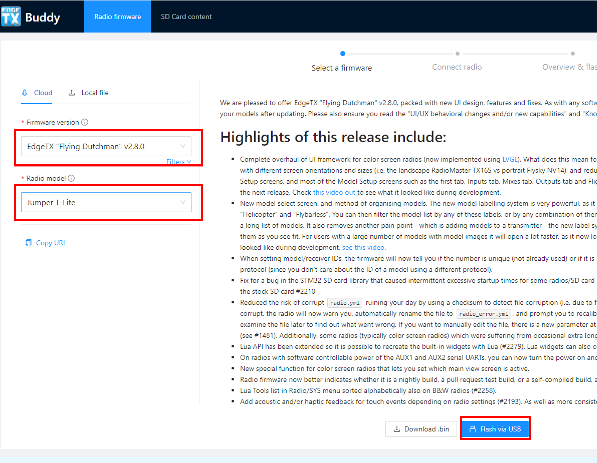
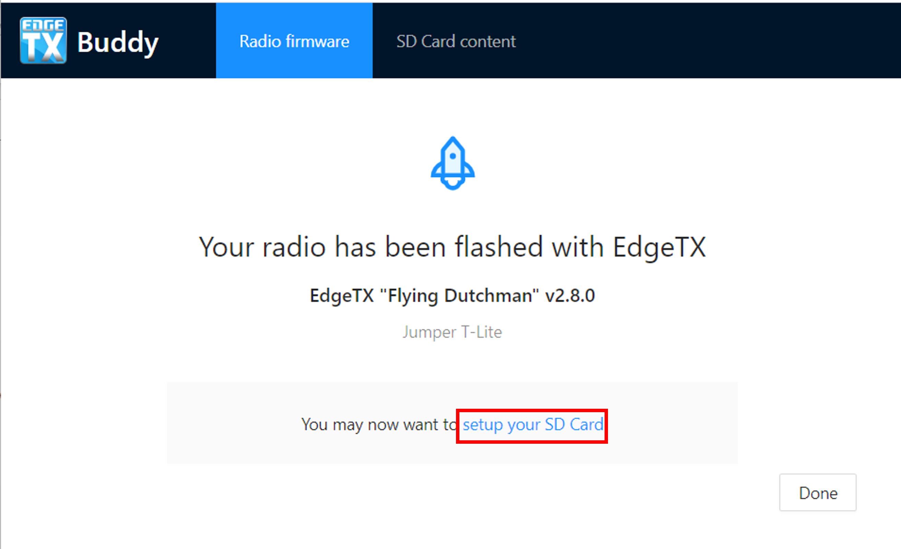

# Update from an earlier version of EdgeTX using EdgeTX Buddy

### Back-up SD Card Contents

**Before making any updates to your radio, we ALWAYS recommend that you back up your current SD Card contents using the following steps.**&#x20;

With your radio powered on, plug your radio into your computer via USB. When prompted by your radio for the USB mode, select **USB Storage**.&#x20;

With your computer, copy the entire contents of your SD card to a safe place on your computer. You can use these files again if you need to roll back the update.

### Update Bootloader and Firmware

With the radio powered off, plug your radio into your computer via USB. This will connect your radio to the computer via DFU mode.&#x20;


On the Jumper T-Pro, you have to plug in the radio while pressing the Boot0 button to enter DFU mode.


Go to this website: [https://buddy.edgetx.org/](https://buddy.edgetx.org/)

Select the **Firmware version** and **Radio model** - then **Flash via USB**.

<figure><figcaption></figcaption></figure>

On the next screen, select the **STM32 Bootloader** device and click **Next**.

<figure><figcaption></figcaption></figure>

If the **STM32 Bootloader** device is not present, then select **Add New Device**. From the pop up window, select **STM32 Bootloader** and click **Connect.**

<figure><figcaption></figcaption></figure>


**Note:** If the STM32 BOOTLOADER is not available to select, then that usually means that there is an issue with the drivers on your computer. You can install the **ImpulseRC Driver Fixer** to fix your computer drivers. It is available to download from here: [**https://impulserc.blob.core.windows.net/utilities/ImpulseRC\_Driver\_Fixer.exe**](https://impulserc.blob.core.windows.net/utilities/ImpulseRC\_Driver\_Fixer.exe)



If you cannot get your computer to detect the STM32 BOOTLOADER, then you must use the bootloader method to update EdgeTX. Skip the remainder of this section and proceed to the [**Update SD Card Contents section**](update-from-opentx-to-edgetx-1.md#update-sd-card-contents). After updating the SD card, we will walk you through updating the firmware via the bootloader.


After selecting the **STM32 Bootloader** device and clicking **Next,** you will be presented with a confirmation screen to verify your settings. Once you have verified everything is correct (Version, Radio, and device) click the **Start Flashing** button.

<figure><figcaption></figcaption></figure>

EdgeTX buddy will now start the flashing sequence. A progress screen will be displayed to show you the progress.

<figure><figcaption></figcaption></figure>

Once the flashing is complete, the next step is to update your SD card. It is not always necessary to update your SD card contents. However, it is recommended. To update your SD card contents, select the **Setup your SD Card** link from the completion screen, which will take you to the SD Card content screen.&#x20;

<figure><figcaption></figcaption></figure>

### Update SD Card Contents

Unplug the radio from the computer and power it on.&#x20;

With the radio turned on, plug it in to your PC via USB and select **USB Storage** when the option is displayed on the radio. Click on the **Select SD Card** option and then navigate to your EdgeTX SD card.&#x20;

<figure><figcaption></figcaption></figure>

The EdgeTX SD Card will be mounted as a USB Drive on your computer. Select the USB Drive and then click on **Select folder.**

<figure><figcaption></figcaption></figure>


Your PC may ask you to give EdgeTX buddy permission to your SD card contents.  This is normal and required for buddy to be able to modify the files on the SD Card.


On the SD Card Content screen, verify the Firmware version and Radio model are still correct, then select the desired language for the sound pack. Click on **Apply Changes.** A status window will pop up and show you the installation progress. Once the installation of the files is complete, the status window will close.

<figure><figcaption></figcaption></figure>


**Note:** EdgeTX Buddy will update all SD card files that are part of the default EdgeTX installation. It will not modify or delete any additional files you have added (LUA scripts, sound files, images, custom themes, model files, radio setup file, etc) that are already existing on the SD card.&#x20;


### Congratulations, you have now successfully updated EdgeTX!

If you were not able to flash your firmware with EdgeTX Buddy, follow the steps below to flash the firmware with the bootloader. Keep your radio connected to your computer via USB and in USB storage mode.

### Update Radio Firmware with the Bootloader

Navigate back to the **Radio Firmware tab.**

Select the **Firmware version** and **Radio model** - then **Download .bin**.

After the firmware is downloaded, you will be asked for the location to save the file. Navigate to the radio's SD card and select the **Firmware** folder. Then select **Save**.&#x20;

<figure><figcaption></figcaption></figure>

Disconnect the USB cable from the radio and turn off the radio.

Boot your radio into bootloader mode  by holding trim switches T4 and T1 to center while pushing the power button on.

You should now see the EdgeTX bootloader. Select the option **Write Firmware**. Select the EdgeTX firmware file that you saved to your SD card. Long-press to flash it.

After the flashing is complete, select **Exit**. The radio will restart with the updated EdgeTX version.

### Congratulations, you have now successfully updated EdgeTX!

