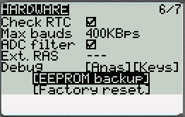
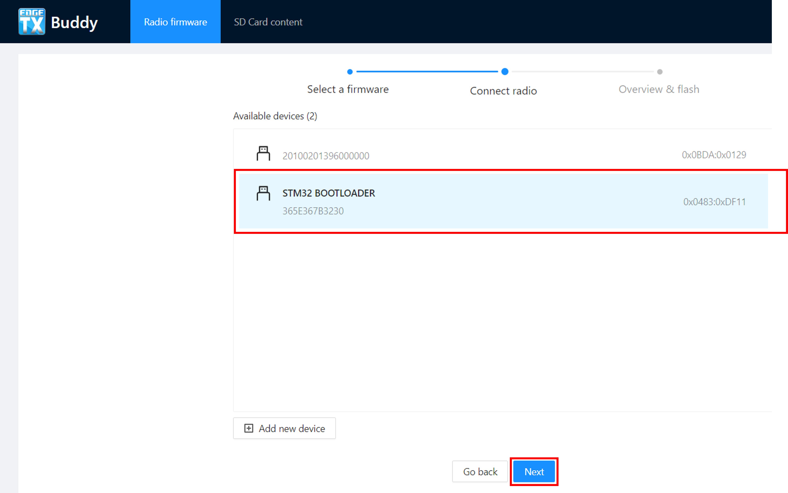
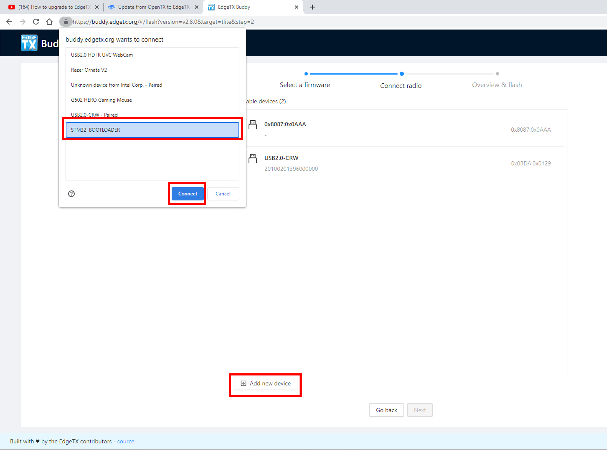
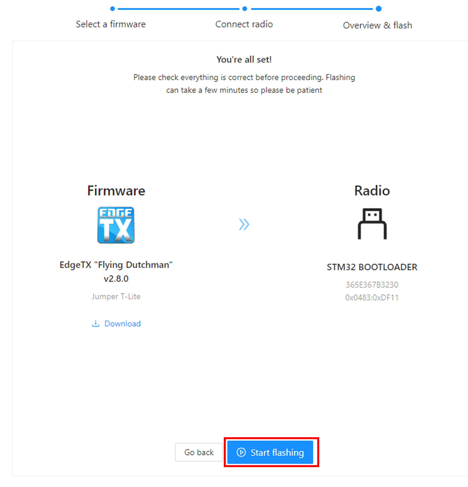
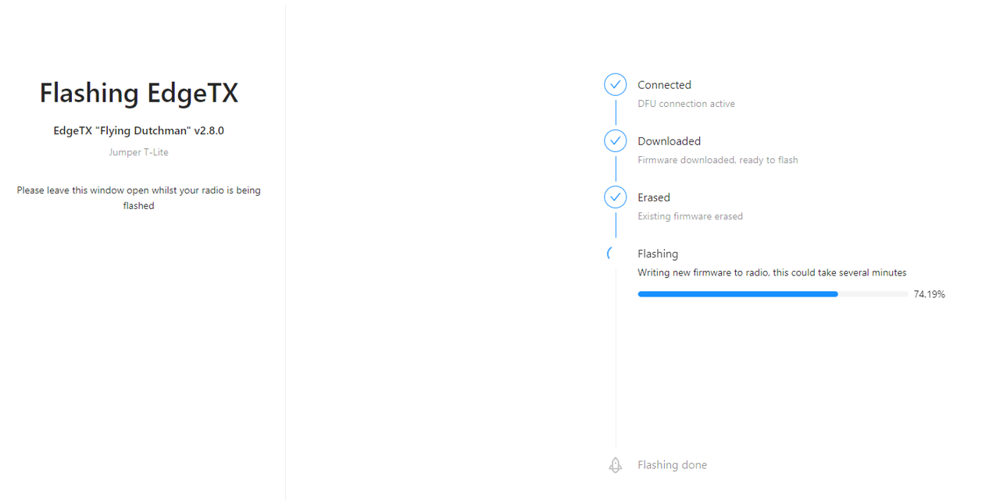
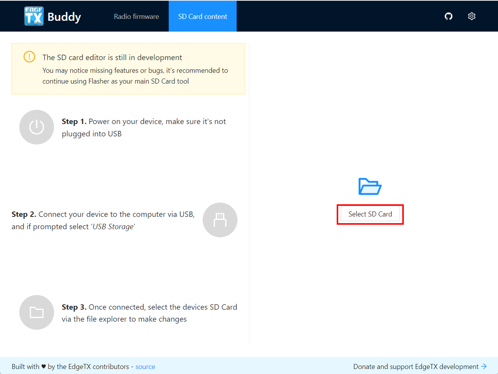
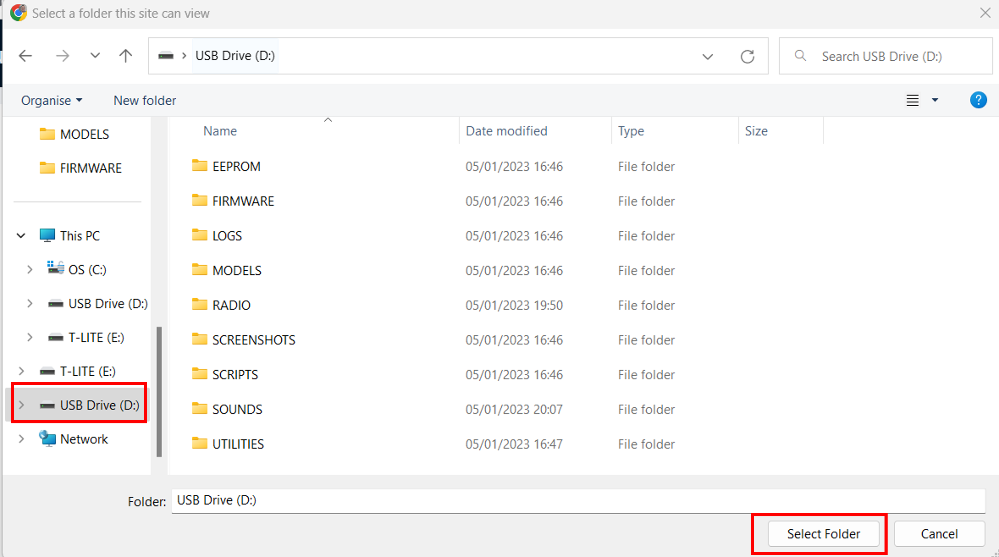
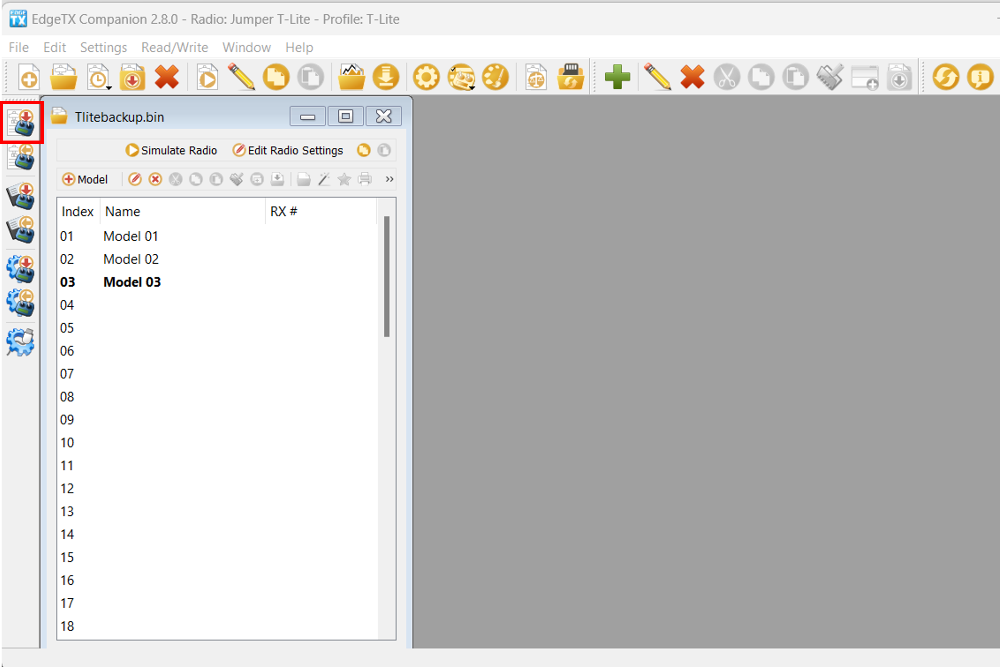

# Migrate from OpenTX to EdgeTX using EdgeTX Buddy

In order to update from OpenTX to EdgeTX you will need to have both OpenTX & EdgeTX Companion installed on your computer.  You can download OpenTX Companion from: [https://downloads.open-tx.org/2.3/release/companion/](https://downloads.open-tx.org/2.3/release/companion/). You can download EdgeTX Companion from: [https://github.com/EdgeTX/edgetx/releases](https://github.com/EdgeTX/edgetx/releases) (File name: edgetx-cpn-\[operation system]-\[version].zip)

### Backup up your models

Turn on your radio, navigate to **Radio Settings**, **Hardware** and scroll down to the bottom of the screen and select **EEPROM backup**. If you do not have this option, then your radio does not store your data in EEPROM and this step can be skipped.&#x20;

<figure><figcaption></figcaption></figure>

With your radio powered on, plug your radio into your computer via USB. When prompted by your radio for the USB mode, select **USB Storage**.&#x20;

With your computer, copy the entire contents of your SD card to a safe place on your Computer. If you ever decide to go back to OpenTX you can use these files again. If you backed up your EEPROM in the step above, check the EEPROM folder to make sure that there is a recent backup file in there.

Start OpenTX Companion.&#x20;

Select the **Backup radio to file** icon from the left side of the screen as shown below. Select a saving location (desktop is fine) and give it a descriptive name.

<figure><figcaption></figcaption></figure>

After the file has been saved, close OpenTX Companion.&#x20;

Delete the contents of the **Model** folder on your SD Card so it is empty.

Unplug the radio from the computer and power it off.

### Flashing EdgeTX Bootloader and Firmware

With the radio powered off, plug your radio into your computer via USB. This will connect your radio to the computer via DFU mode.&#x20;


On the Jumper T-Pro, you have to plug in the radio while pressing the Boot0 button to enter DFU mode.


Go to this website: [https://buddy.edgetx.org/](https://buddy.edgetx.org/)

Select the **Firmware version** and **Radio model** - then **Flash via USB**.

<figure><figcaption></figcaption></figure>

On the next screen, select the **STM32 Bootloader** device and click **Next**.

<figure><figcaption></figcaption></figure>

If the **STM32 Bootloader** device is not present, then select **Add New Device**. From the pop up window, select **STM32 Bootloader** and click **Connect.**

<figure><figcaption></figcaption></figure>

After selecting the **STM32 Bootloader** device and clicking **Next,** you will be presented with a confirmation screen to verify your settings. Once you have verified everything is correct (Version, Radio, and device) click the **Start Flashing** button.

<figure><figcaption></figcaption></figure>

EdgeTX buddy will now start the flashing sequence. A progress screen will be displayed to show you the progress.

<figure><figcaption></figcaption></figure>

Once the flashing is complete, select the **setup your SD Card** link from the completion screen which will take you to the SD Card content screen.&#x20;

At this point, the EdgeTX bootloader and firmware have been installed on your radio. The next step is to install the SD Card contents.

### SD Card Preparation

<figure><figcaption></figcaption></figure>

Unplug the radio from the computer and power it on. You should see the EdgeTX Splash screen on the radio, but you will still hear "Welcome to OpenTX". This is normal - we will install the EdgeTX sound pack with the SD card contents next.

With the radio turned on, plug it in to your PC via USB and select **USB Storage** when the option is displayed on the radio. Click on the **Select SD Card** option and then navigate to your EdgeTX SD card.&#x20;

<figure><figcaption></figcaption></figure>

The EdgeTX SD Card will be mounted as a USB Drive on your computer. Select the USB Drive (notice the OpenTX files are still in there - that is the correct one.) and then click on **Select folder.**

<figure><figcaption></figcaption></figure>


Your PC may ask you to give EdgeTX buddy permission to your SD card contents.  This is normal and required for buddy to be able to modify the files on the SD Card.


On the SD Card Content screen, verify the Firmware version and Radio model are still correct, then select the desired language for the sound pack. Click on **Apply Changes.** A status window will pop up and show you the installation progress. Once the installation of the files is complete, the status window will close.

<figure><figcaption></figcaption></figure>

At this point, you now have the EdgeTX Bootloader, Firmware and the SD card contents installed. The last step is to convert your models over from OpenTX and put them on the radio. You can now close EdgeTX Buddy.

### Restoring your Models from OpenTX

Open EdgeTX Companion. If you have not already done so, create a radio profile for your radio and make sure that it is selected as active.

In the upper left corner of Companion, select **File**, then **Open**, then select the OpenTX Backup file that you made at the very beginning. A warning message will be displayed. Click **OK**.

<figure><figcaption></figcaption></figure>

You will then see all your models from OpenTX in EdgeTX Companion. Click on the **Write models and Settings to Radio** button. It will warn you that it will overwrite all the models on your radio.  Click **Yes.**&#x20;

<figure><figcaption></figcaption></figure>

The models and settings will be written to the radio.  A message will be displayed when complete.  Click on **OK**. Unplug your radio from the USB port and close EdgeTX Companion.

<figure><figcaption></figcaption></figure>

### Congratulations, you have now successfully updated to EdgeTX!

All of your models have been updated to the EdgeTX .yml format and you have the EdgeTX sound pack installed. You are now ready to use EdgeTX.


_Unfortunately, it is not possible to copy over the setup for your widgets from OpenTX. They will have to be set up again manually in EdgeTX._



Your Lua Scripts from OpenTX will still be on your SD Card. However, they may not all work with EdgeTX and may need to be re-installed to get them to work.  You can find a list of EdgeTX-compatible LUA scripts here: [https://github.com/EdgeTX/lua-scripts](https://github.com/EdgeTX/lua-scripts)

