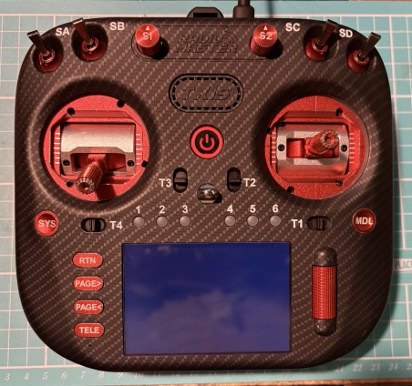
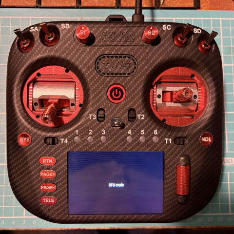

# Updating your STM32H7 radio

Due to a different architecture design, radio transmitters using STM32H7 MCUs update differently to what you may be familiar with on older STM32F2 and STMF4 based designs (i.e. [DFU mode flashing](update-from-opentx-to-edgetx-1.md) or coping a file to the SD card / onboard storage and then[ flashing the bootloader from the firmware, and the firmware from the bootloader](update-from-an-earlier-version-of-edgetx-using-the-bootloader.md)). STM32H7 MCUs still have DFU mode, but cannot be flashed via traditional DFU tools.&#x20;

There are basically two methods of flashing them at present:

* Bootloader and UF2 file copy
* EdgeTX Companion (v2.12 or later)

## File Copy / Download (UF2)

This method of flashing is relatively simple:

1. Put the radio into bootloader mode (on most radios, this is done by powering up the radio, with the horizontal trims held inwards - but you can [check here for your specific radio](../edgetx-how-to/access-dfu-and-bootloader-mode.md)).&#x20;
2. Connect the radio to your computer (don't use a USB-C to USB-C cable, always use a USB-A to USB-C cable - most likely one came with your radio, and then use a converter/hub if needed).&#x20;
3. Save / copy the firmware update to your  for your radio to the `EDGETX_UF2` drive that should now be available. This could be done by either:
   1. Downloading the firmware in advance from [EdgeTX Buddy](https://buddy.edgetx.org/) to your computer, or downloading directly to the radio.
   2. Downloading the firmware zip file from the [GitHub Releases](https://github.com/EdgeTX/edgetx/releases) page and copying the firmware for your specific radio from the zip file.&#x20;
4. Once the file has started transferring to the radio, the screen of the radio should change to show the update progress.&#x20;
5. Once the update has completed, you can safely eject / disconnect your radio, and it should automatically restart. Both the radio firmware and bootloader will now be up-to-date!

## EdgeTX Companion (DFU/UF2)

Companion can update STM32H7-based radios in one of two ways - via UF2 or DFU mode. Which mode you use depends on the state the transmitter is in when you connect it to your computer (i.e. whether you connected it with the radio at the bootloader (for UF2), or in DFU mode.

1. Download the firmware. For example, either:
   1. use the update functionality in Companion (`Tools -> Update Components...`)
   2. download using [EdgeTX Buddy](https://buddy.edgetx.org/)
   3. download the firmware zip file from the [GitHub Releases](https://github.com/EdgeTX/edgetx/releases) page
2. Ensure you have the correct radio profile loaded in Companion if you have multiple radios. Otherwise, it will prevent you from writing firmware so that you don't flash the wrong firmware to the wrong radio.&#x20;
3. Connect the radio to your computer (don't use a USB-C to USB-C cable, always use a USB-A to USB-C cable - most likely one came with your radio, and then use a converter/hub if needed). Either connect the radio when in bootloader mode (for UF2) or in DFU Mode. [Check here how to do this for your specific radio](../edgetx-how-to/access-dfu-and-bootloader-mode.md).
4. Choose the `Radio -> Write Firmware to Radio` option. If Companion does not detect your radio in either DFU or UF2 mode, it will show a warning message - resolve the issue, and press the "Detect" button on the next screen if the radio was not detected.
5. Load / locate the firmware file if it is not already selected, and choose `Write to TX` when ready. It is advisable to back up your current firmware if you have not done so recently.&#x20;

<figure><figcaption>
Flysky PA01 in Bootloader (UF2) Mode
</figcaption></figure> <figure><figcaption>
RadioMaster TX15 in DFU Mode
</figcaption></figure>


If you flash via DFU, initially your radio screen will be blank, and then will change to indicate it is in "DFU Mode" when it is in the second stage of flashing the firmware. See below on the RadioMaster TX15.

 


## Troubleshooting

* If your computer does not detect the radio when in DFU mode then that usually means that there is either an issue with your USB cable / connection (i.e. the USB cable is a "charge only" cable, or you used a USB-C to USB-C cable rather than a USB-C to USB-A cable and a USB hub / converer), or an issue with the drivers on your computer. You can install the [ImpulseRC Driver Fixer](https://impulserc.blob.core.windows.net/utilities/ImpulseRC_Driver_Fixer.exe) to fix / install the necessary DFU drivers.
* If you run into an issue with updating via UF2 not being possible due to running out of space on the `EDGETX_UF2` drive, you can either try again in DFU mode, or for the moment, contact us on [Discord](https://discord.gg/wF9wUKnZ6H) to get a special recovery firmware file for your radio. &#x20;

